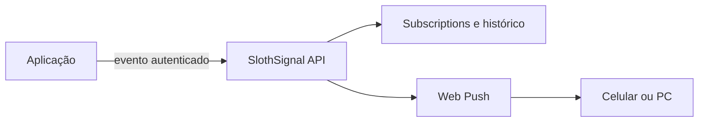

# SlothSignal

Serviço de notificações reutilizável para os projetos da Dullshift.

> Estado atual: arquitetura definida; implementação ainda não iniciada.

## Propósito

O SlothSignal receberá eventos de outros sistemas e entregará Web Push no celular ou computador. Ele não conhecerá regras de UserTesting, CalendarMate ou qualquer produto específico — apenas eventos padronizados.



## Primeira integração

O primeiro consumidor será o **SlothMint**:

```text
SlothMint → POST /api/notifications → SlothSignal → Web Push
```

Eventos iniciais planejados:

- `opportunity.created`
- `earning.approved`
- `earning.paid`

## Escopo planejado da V1

- API REST/webhook autenticada por aplicação;
- cadastro e revogação de dispositivos;
- Web Push com VAPID e service worker;
- preferências por aplicação e tipo de evento;
- deduplicação com `dedupeKey`;
- expiração/TTL para alertas urgentes;
- histórico de envio, clique e falha;
- redirecionamento seguro ao tocar na notificação;
- Next.js/Vercel + Supabase Free.

## Fora do escopo inicial

- Gmail ou detectores de oportunidade;
- regras de negócio dos sistemas consumidores;
- WhatsApp, Telegram, Discord, SMS ou e-mail;
- automação de tarefas nas plataformas.

## Exemplo de contrato futuro

```json
{
  "app": "slothmint",
  "event": "opportunity.created",
  "title": "Novo teste no UserTesting",
  "body": "US$ 10 · aproximadamente 20 minutos",
  "url": "https://example.com/task/123",
  "priority": "high",
  "expiresAt": "2026-09-18T15:30:00Z",
  "dedupeKey": "usertesting:opportunity:123"
}
```

## Princípio arquitetural

O SlothSignal será um serviço independente, não a transformação de todos os projetos em microsserviços. Cada consumidor poderá continuar como monólito modular e usar este componente apenas para entrega de notificações.
